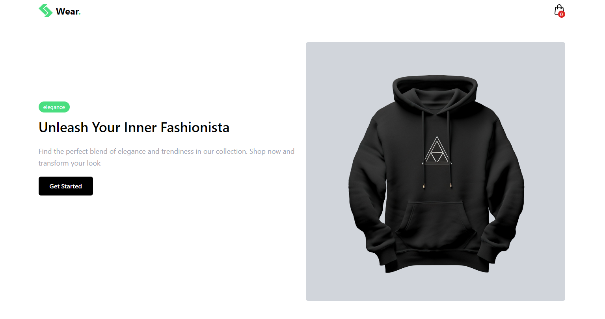
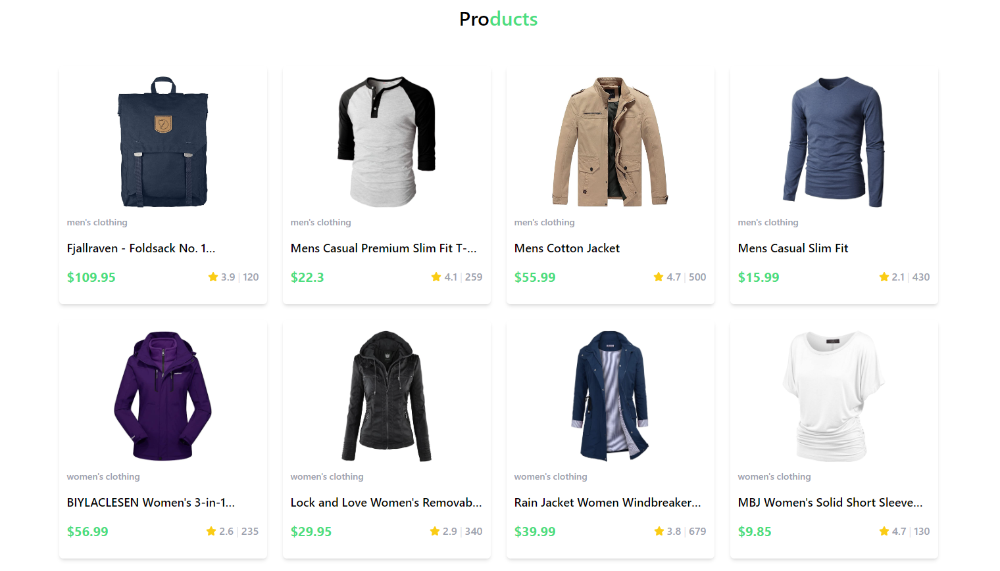
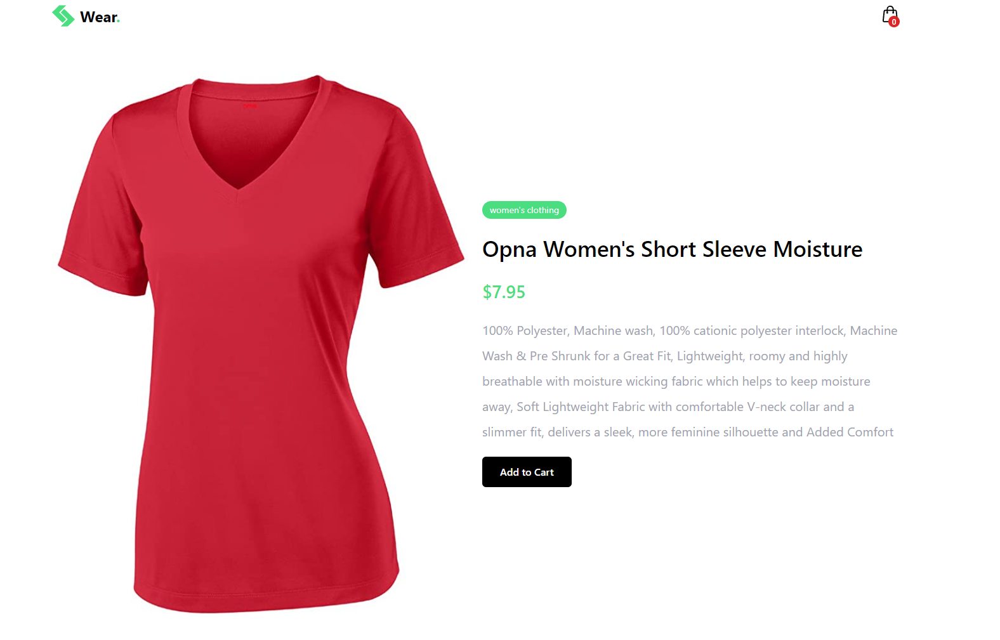
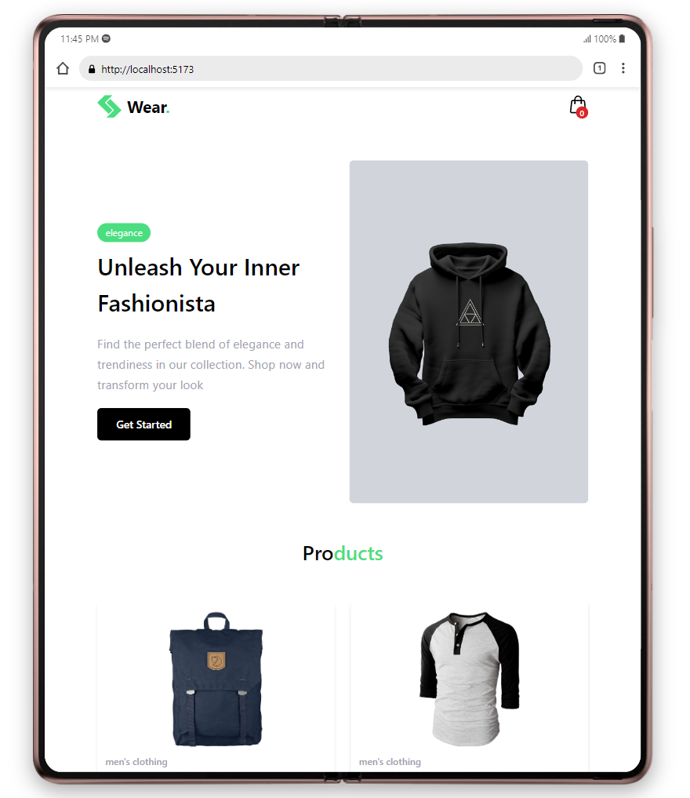

## Simple-Commerce

Simple Commerce is a simple and intuitive e-commerce platform developed using React. This project aims to integrate various React concepts, including data fetching from API endpoints utilizing the built-in Fetch API, dynamic and static routing with the React Router DOM package, state management through the Context API, and the implementation of a clean user interface using Tailwind CSS.

### Important Links

1. [fakestore Api](https://fakestoreapi.com/)
2. [React router DOM](https://reactrouter.com/en/main)
3. [Taiwind CSS](https://tailwindcss.com/docs/installation)
4. [React Icons](https://react-icons.github.io/react-icons/)

## Project Preview

### Hero section

### Products Section

### Product Details

## Responsive Design

### Smartphone

### Ipad

